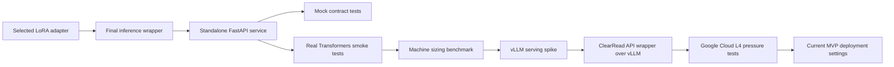

# ClearRead AI Model Deployment

This folder collects the deployable parts of the ClearRead AI summary model work. It is organised so that a reviewer can understand the deployment path from the selected LoRA model artifact to a working API service, including the main retries and validation steps.

## What This Package Contains

| Folder | Purpose |
|---|---|
| `service/` | Standalone FastAPI AI Summary service, requirements, and API tests. |
| `benchmarks/` | Scripts used for local machine sizing, vLLM SLA testing, Google Cloud pressure testing, and L4 diagnosis. |
| `docs/` | Service contract, deployment process, backend integration notes, and restart runbook. |
| `reports/` | Summaries of testing, security, serving research, cloud pressure testing, and quality checks. |
| `integration/` | Notes on how the deployment work connects back to the main ClearRead backend. |
| `manifests/` | Machine-readable lists of included files and external artifacts. |

Large model artifacts, adapters, raw benchmark outputs, logs, temporary VM details, API keys, and local machine paths are deliberately not included. They are described in the manifests and reports instead.

## End-To-End Path



The selected model route is:

- Base model: `unsloth/Llama-3.1-8B-Instruct-unsloth-bnb-4bit`
- Fine-tuning method: SFT with QLoRA
- Selected adapter: `full_candidate_a_3epoch`
- Public service: `clearread-ai-summary`
- Main endpoint: `POST /v1/clearread/summarize`

## Current Deployment Result

The deployment work ended with a ClearRead API wrapper in front of an internal vLLM server. The wrapper exposes only the ClearRead contract and hides raw vLLM routes, raw model output, local paths, prompts, and adapter details.

Current MVP capacity found on the tested Google Cloud L4 setup:

| Setting | Result |
|---|---|
| Stable current cap | 28 representative text blocks per request |
| Conservative product cap | 24 representative text blocks per request |
| Not stable for the current 30-second target | 32 representative text blocks |
| Max characters per text block | 11000 |
| Request body limit | 2 MiB |

The code-level default remains `maxTextsPerRequest=32`, but the measured live L4 configuration used `28` because repeated 28-block tests stayed under the target while repeated 32-block tests did not.

## How To Run The Service Locally

Use mock mode first to validate the API contract without model artifacts:

```powershell
cd ai/model_deployment/service
$env:CLEARREAD_AI_RUNTIME="mock"
$env:CLEARREAD_AI_SERVICE_API_KEY="replace-with-local-dev-key"
python -m uvicorn ai_summary_service.main:app --host 127.0.0.1 --port 8010
```

Then call:

```bash
curl -s http://127.0.0.1:8010/health
curl -s http://127.0.0.1:8010/ready
```

For real model inference, configure the wrapper, inference config, and adapter paths through environment variables. Model artifacts should live outside Git.

## Key Documents

- `docs/end_to_end_deployment_process.md`: full deployment story, including retries and changes of direction.
- `docs/api_contract.md`: public API contract implemented by the service.
- `reports/model_serving_and_benchmark_summary.md`: why the deployment moved from Transformers to vLLM.
- `reports/gcp_l4_pressure_test_report.md`: final capacity result for the L4 MVP deployment.
- `reports/security_and_privacy_summary.md`: security and privacy controls.

## Verification Commands

From this repository root:

```powershell
python -m compileall -q ai\model_deployment\service\ai_summary_service ai\model_deployment\service\tests ai\model_deployment\benchmarks
cd ai\model_deployment\service
python -m pytest tests\ai_summary_service
```
